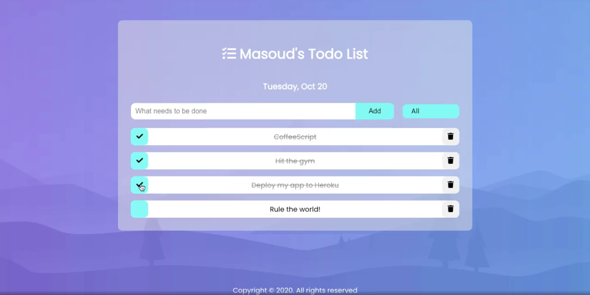

# Todo-List

Published at [https://masoudsoleymani.github.io/todo-list](https://masoudsoleymani.github.io/todo-list)

## Status
fulfilled

## Development 

  ### Prerequisites
  - [Node.js](https://nodejs.org/en/)
  - [yarn](https://classic.yarnpkg.com/en/docs/install/)

  ### Installation
  - clone the repo
  - `yarn` for dependencies installation

  ### Running
  - `yarn start` 
  - `yarn build` for production
  - Open [http://localhost:3000](http://localhost:3000)

You can see any lint errors on the console

## Features
- Responsive layout;
- Active & completed tasks archive view;

## Technologies
- HTML5
- CSS3
- javascript
- ES6
- Font Awesome
- ReactJS

## Screen

## License

This project is licensed under the terms of the MIT license. See [LICENSE](LICENSE) 
